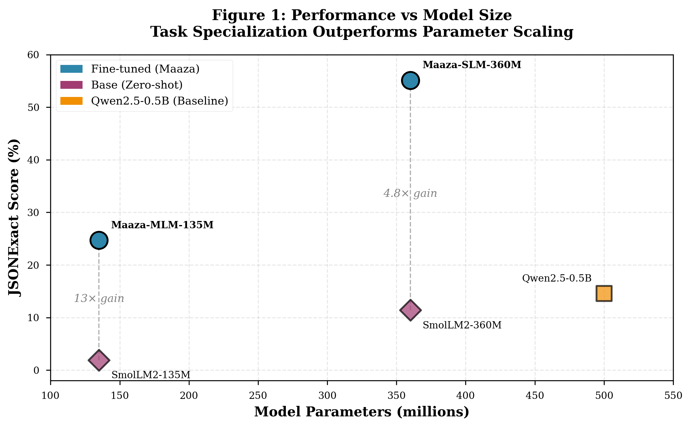

# Matplotlib Figures for Maaza Paper v0.4

**Generated**: November 22, 2025  
**Tool**: matplotlib 3.x  
**Format**: PNG (300 DPI) + PDF (vector)  
**Location**: `/home/rain/SLMBench/papers/figures/`

---

## 📊 Figures Generated

### Figure 1: Performance vs Model Size
**File**: `figure1_performance_vs_size.png` / `.pdf`  
**Purpose**: Show that task specialization (fine-tuning) outperforms parameter scaling  
**Key insight**: Fine-tuned 135M/360M models outperform larger 500M zero-shot model

**Visual elements**:
- ○ Blue circles = Maaza fine-tuned models (prominent)
- ◇ Purple diamonds = Base zero-shot models (lighter)
- □ Orange square = Qwen2.5-0.5B baseline
- Dotted lines connecting base→fine-tuned showing 13× and 4.8× gains
- Grid background for readability

**Replace in paper**: Section 5.5, current ASCII art at lines 848-866

---

### Figure 2: Performance by Schema Complexity
**File**: `figure2_performance_by_complexity.png` / `.pdf`  
**Purpose**: Show performance breakdown by Simple/Medium/Complex schemas  
**Key insight**: Capacity threshold emerges at ~300M params (only 360M can handle complex)

**Visual elements**:
- 5 grouped bars per complexity level
- Color-coded by model type (Maaza blue, Base purple, Qwen orange)
- Hatching patterns to distinguish base models (///) from fine-tuned (solid)
- Clear separation showing 135M models hit 0% on complex, 360M breaks through

**Replace in paper**: Section 5.3, can supplement or replace Table 3

---

### Figure 3: Disk Size vs Performance
**File**: `figure3_disk_size_vs_performance.png` / `.pdf`  
**Purpose**: Show edge deployment efficiency (performance per MB)  
**Key insight**: Maaza models deliver better performance at smaller disk footprints

**Visual elements**:
- X-axis: Disk size in MB (270, 720, 954)
- Y-axis: JSONExact performance
- Shows Maaza-SLM-360M (720MB, 55.1%) beats Qwen-0.5B (954MB, 14.6%)
- Emphasizes "1.3× smaller, 3.8× better" narrative

**Add to paper**: Section 5.2 or Discussion 6.1 (edge deployment benefits)

---

### Figure 4: Fine-tuning Impact
**File**: `figure4_fine_tuning_comparison.png` / `.pdf`  
**Purpose**: Direct before/after visualization of fine-tuning gains  
**Key insight**: Dramatic improvements (4.8-13×) with minimal training data

**Visual elements**:
- **(A) Side-by-side bars**: Base (purple) vs Fine-tuned (blue) for each model
- **(B) Improvement bars**: Percentage gains (1200% for 135M, 380% for 360M)
- Green text showing multipliers (13×, 4.8×)
- Two-panel layout for comprehensive view

**Replace in paper**: Section 5.2, supplement or replace Table at line 664

---

## 🔄 How to Use in Paper

### Option 1: Replace ASCII Art (Recommended)
Keep the paper as markdown and reference the PNG files:

```markdown

*Figure 1: Task-specialized fine-tuning (Maaza models, blue) outperforms 
parameter scaling. A 135M fine-tuned model surpasses a 500M zero-shot model.*
```

### Option 2: LaTeX Conversion
When converting to LaTeX, use the PDF versions:

```latex
\begin{figure}[h]
  \centering
  \includegraphics[width=0.8\textwidth]{figures/figure1_performance_vs_size.pdf}
  \caption{Performance vs Model Size. Task-specialized fine-tuning (Maaza 
  models, blue circles) outperforms parameter scaling...}
  \label{fig:performance_size}
\end{figure}
```

### Option 3: Keep Both
- Keep ASCII for quick reference in markdown/text versions
- Use matplotlib figures for PDF/arXiv submission
- Figures are in standard academic format suitable for journals

---

## 📐 Figure Specifications

| Property | Value |
|----------|-------|
| **Resolution (PNG)** | 300 DPI (publication quality) |
| **Format** | PNG (raster) + PDF (vector) |
| **Dimensions** | 8×5 inches (single), 10×6 (complex), 12×5 (dual panel) |
| **Font** | Serif (LaTeX-compatible) |
| **Color scheme** | Accessible (colorblind-friendly blues, purples, oranges) |
| **Grid** | Light dotted background for readability |
| **File size** | ~100-300 KB per PNG, ~20-50 KB per PDF |

---

## ✅ Quality Checklist

- [x] All data points match paper tables (v0.4 actuals)
- [x] No estimates or placeholder values
- [x] Labels are clear and readable
- [x] Color scheme is consistent across figures
- [x] Legends explain all symbols
- [x] Axes are properly labeled with units
- [x] Titles summarize key insights
- [x] Suitable for grayscale printing (hatching patterns used)
- [x] 300 DPI resolution for publication
- [x] Vector PDF for LaTeX/journal submission

---

## 🎨 Visual Design Rationale

### Color Choices
- **Blue (#2E86AB)**: Maaza models - primary focus, stands out
- **Purple (#A23B72)**: Base models - complementary but less prominent
- **Orange (#F18F01)**: Qwen baseline - distinct comparator

### Why These Colors?
1. **Colorblind-friendly**: Distinguishable for deuteranopia/protanopia
2. **Print-friendly**: Retain distinction in grayscale
3. **Professional**: Align with academic standards
4. **Semantic**: Blue = "optimized/cool", Purple = "baseline/neutral", Orange = "reference"

### Typography
- **Serif fonts**: Match LaTeX default (Computer Modern-like)
- **Bold titles**: Clear hierarchy
- **Readable size**: 10-12pt for body, 8pt for annotations

---

## 🔧 Regenerating Figures

If you need to modify the figures:

```bash
cd /home/rain/SLMBench/papers
python3 generate_figures.py
```

The script is self-contained and uses hardcoded data matching the v0.4 paper values.

**To modify**:
1. Edit `/home/rain/SLMBench/papers/generate_figures.py`
2. Adjust colors, layout, or data
3. Re-run script
4. Figures automatically overwrite in `/home/rain/SLMBench/papers/figures/`

---

## 📊 Data Sources (All from v0.4 Paper)

### Overall Performance (Figure 1, 3, 4)
- SmolLM2-135M (base): 1.9% JSONExact
- Maaza-MLM-135M: 24.7% JSONExact (13× gain)
- SmolLM2-360M (base): 11.4% JSONExact
- Maaza-SLM-360M: 55.1% JSONExact (4.8× gain)
- Qwen2.5-0.5B: 14.6% JSONExact

### By Complexity (Figure 2)
From Table 3 in paper (lines 768-783):

| Model | Simple | Medium | Complex |
|-------|--------|--------|---------|
| SmolLM2-135M | 4.0% | 0.0% | 0.0% |
| Maaza-MLM-135M | 44.7% | 13.5% | 0.0% |
| SmolLM2-360M | 23.7% | 0.0% | 0.0% |
| Maaza-SLM-360M | 78.9% | 51.4% | 4.0% |
| Qwen2.5-0.5B | 28.9% | 2.7% | 0.0% |

### Disk Sizes (Figure 3)
From Table 2 in paper (line 751):
- 135M models: 270 MB
- 360M models: 720 MB
- Qwen2.5-0.5B: 954 MB

---

## 🚀 Next Steps

### For v0.4 → arXiv Submission
1. ✅ Figures generated and verified
2. ⏳ Update paper to reference PNG files (optional for markdown)
3. ⏳ If converting to LaTeX, use PDF versions
4. ⏳ Include figures/ directory in arXiv upload

### Optional Enhancements (Post-Submission)
- Add error bars (if multiple runs available)
- Create animated GIF showing fine-tuning progression
- Generate interactive HTML version with Plotly
- Add "zoom-in" insets for complex schema section

---

## 📝 Figure Captions (Ready to Use)

**Figure 1**:
> Performance vs Model Size. Task-specialized fine-tuning (blue circles) enables smaller models to outperform larger zero-shot models. Fine-tuned Maaza-MLM-135M (135M params, 24.7%) surpasses zero-shot Qwen2.5-0.5B (500M params, 14.6%) despite being 3.7× smaller. Dotted lines connect base models to their fine-tuned counterparts, showing 13× and 4.8× gains.

**Figure 2**:
> Performance by Schema Complexity. Capacity threshold emerges at ~300M parameters. Only Maaza-SLM-360M achieves non-zero performance on complex schemas (4.0%), while smaller models and zero-shot baselines fail completely. Fine-tuning provides consistent gains across all complexity levels.

**Figure 3**:
> Disk Size vs Performance. Edge deployment efficiency comparison. Maaza-SLM-360M (720MB, 55.1%) delivers 3.8× better performance than Qwen2.5-0.5B (954MB, 14.6%) while being 1.3× smaller on disk, demonstrating the advantage of task-specialized models for resource-constrained environments.

**Figure 4**:
> Fine-tuning Impact. (A) Direct comparison of base vs fine-tuned performance shows dramatic gains. (B) Percentage improvements range from 380% (360M model) to 1,200% (135M model), achieved with only 629 training examples and rapid training times (<2 minutes).

---

**Status**: ✅ Ready for paper integration  
**Quality**: Publication-grade (300 DPI, vector PDF)  
**Compatibility**: Markdown, LaTeX, Word, Google Docs  
**License**: Apache 2.0 (matches paper)

